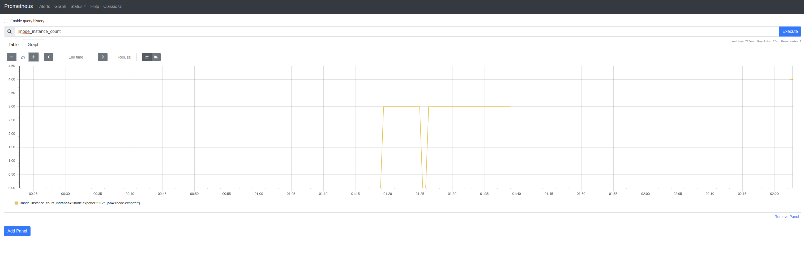

# [Prometheus Exporter](https://prometheus.io/docs/instrumenting/exporters/) for [Linode](https://www.linode.com)

[](https://github.com/DazWilkin/linode-exporter/actions/workflows/build.yml)
[](https://pkg.go.dev/github.com/DazWilkin/linode-exporter)
[](https://goreportcard.com/report/github.com/DazWilkin/linode-exporter)

Inspired by and templated from [DigitalOcean Exporter](https://github.com/metalmatze/digitalocean_exporter).

Thanks [metalmatze](https://github.com/metalmatze)!



## References

+ [Linode Exporter](https://pretired.dazwilkin.com/posts/191218/)

## Development Installation

```bash
go get github.com/DazWilkin/linode-exporter
```
Then:
```bash
LINODE_TOKEN=[[YOUR-LINODE-API-TOKEN]]
ENDPOINT=":9388"
METRICS="/metrics"

go run github.com/DazWilkin/linode-exporter \
--endpoint=${ENDPOINT} \
--path=${METRICS}
```

## Run-only Installation

### Linode Exporter only

Either:
```bash
LINODE_TOKEN=[[LINODE-API-TOKEN]]
PORT=9388
docker run \
--interactive \
--tty \
-e LINODE_TOKEN=${LINODE_TOKEN} \
--publish=${PORT}:${PORT} \
ghcr.io/dazwilkin/linode-exporter:4ed5b0f2f81c495c65716d824f2da339ce753282
```

The exporter's metrics endpoint will be available on `http://localhost:${PORT}/metrics`

### Linode Exporter with [Prometheus](https://prometheus.io), [AlertManager](https://prometheus.io/docs/alerting/alertmanager/) and [cAdvisor](https://github.com/google/cadvisor)

**NB** AlertManager integration is a work-in-progress

The following
```bash
LINODE_TOKEN=[[LINODE-API-TOKEN]]
docker-compose --file=${PWD}/docker-compose.yaml up
```
You may check the state of the services using:
```bash
docker-compose ps
```
And logs for a specific service using, e.g.:
```bash
docker-compose logs linode-exporter
```
The following endpoints are exposed:
+ Linode-Exporter metrics: `http://localhost:9388/metrics`
+ Prometheus UI: `http://localhost:9090`
+ AlertManager UI: `http://localhost:9093`
+ cAdvisor UI: `http://localhost:8085`

**NB** cAdvisor is mapped to `:8085` rather than it's default port `:8080`

Using the Prometheus UI, you may begin querying metrics by typing `linode_` to see the available set.

The full list is below.

## Metrics

| Name                                         | Type    | Description
| ----                                         | ----    | -----------
| `linode_account_balance`                     | Gauge   |
| `linode_account_uninvoiced`                  | Gauge   |
| `linode_exporter_up`                         | Counter | A metric with a constant value of '1' labeled with go, OS and the exporter versions
| `linode_instance_up`                         | Counter |
| `linode_instance_disk`                       | Gauge   |
| `linode_instance_memory`                     | Gauge   |
| `linode_instance_cpus`                       | Gauge   |
| `linode_kubernetes_up`                       | Counter |
| `linode_kubernetes_pool`                     | Counter |
| `linode_kubernetes_linode_up`                | Counter |
| `linode_nodebalancer_count`                  | Gauge   |
| `linode_nodebalancer_transfer_total_bytes`   | Gauge   |
| `linode_nodebalancer_transfer_out_bytes`     | Gauge   |
| `linode_nodebalancer_transfer_in_bytes`      | Gauge   |
| `linode_objectstorage_objects_count`         | Gauge   |
| `linode_objectstorage_size_bytes`            | Gauge   |
| `linode_volume_up`                           | Counter |
| `linode_tickets_count`                       | Gauge   |

Please file issues and feature requests

## Development

Each 'collector' is defined under `/collectors/[name].go`.

Collectors are instantiated by `main.go` with `registry.MustRegister(NewSomethingCollector(linodeClient))`

The `[name].go` collector implements Prometheus' Collector interface: `Collect` and `Describe`

## Documentation

https://godoc.org/github.com/DazWilkin/linode-exporter/collector

## Port Allocation

Registered "Linode Exporter" on Prometheus Wiki's [Default Port Allocations](https://github.com/prometheus/prometheus/wiki/Default-port-allocations#exporters-starting-at-9100) with port 9388.

## Sigstore

`linode-exporter` container images are being signed by [Sigstore](https://www.sigstore.dev/) and may be verified:

```bash
cosign verify \
--key=./cosign.pub \
ghcr.io/dazwilkin/linode-exporter:4ed5b0f2f81c495c65716d824f2da339ce753282
```

> **NOTE** `cosign.pub` may be downloaded from [here](./cosign.pub)

To install|update `cosign`:
```bash
go install github.com/sigstore/cosign/cmd/cosign@latest
```

## Similar Exporters

+ [Prometheus Exporter for Azure](https://github.com/DazWilkin/azure-exporter)
+ [Prometheus Exporter for Fly.io](https://github.com/DazWilkin/fly-exporter)
+ [Prometheus Exporter for GCP](https://github.com/DazWilkin/gcp-exporter)
+ [Prometheus Exporter for Koyeb](https://github.com/DazWilkin/koyeb-exporter)
+ [Prometheus Exporter for Vultr](https://github.com/DazWilkin/vultr-exporter)

<hr/>
<br/>
<a href="https://www.buymeacoffee.com/dazwilkin" target="_blank"></a>
